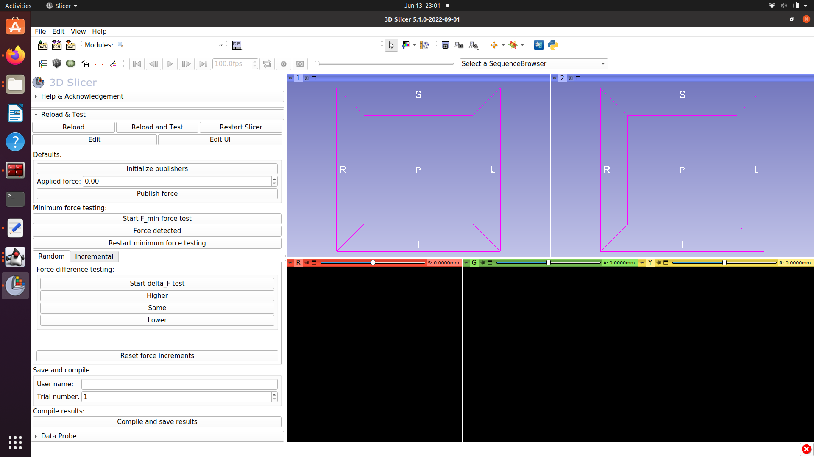

## "Just noticeable difference" module
This Slicer module was designed to conduct simple parameter tuning for 
ROS supported robots and SlicerROS2 (https://github.com/rosmed/slicer_ros2_module).

## Setup instructions:

1. Initialize ROS interface for the device. For the Touch Robot, we use the interface and setup described here: https://slicer-ros2.readthedocs.io/en/v1.0/pages/robot-visualization.html#phantom-omni
2. Go to the SlicerROS2 module in 3D Slicer to active the SlicerROS2 node
3. Switch to the "JustNoticeableDiff" module to activate the testing

4. Initialize the publishers using the button at the top of the module
5. Ensure that force is being applied with the selector and "Publish Force" button
6. Experiment with the scripts for minimum force testing, random, and incremental.
7. Once finished, you can add the user name and press ``Compile and save results`` to save the recorded responses as a CSV file.
